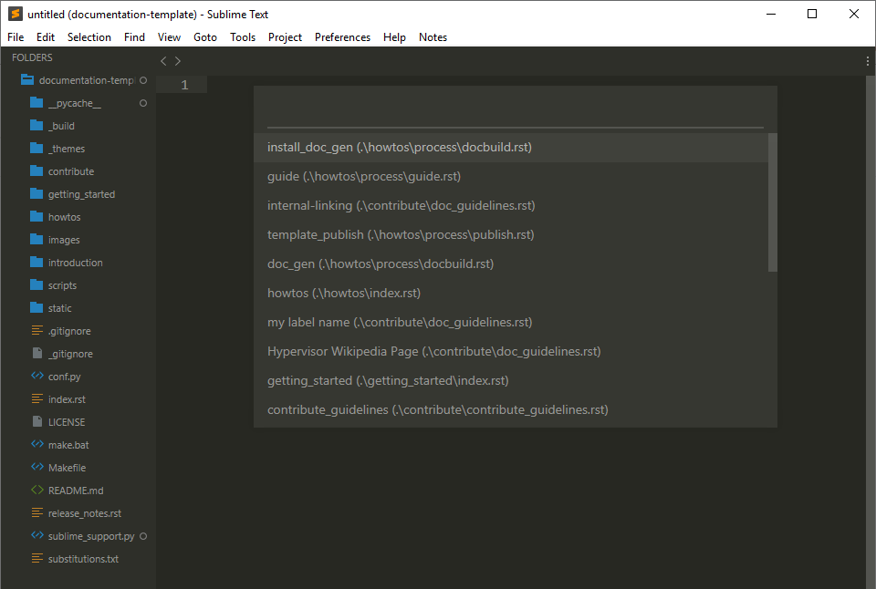

Sphinx Ref Helper
#################

.. image:: https://img.shields.io/badge/License-Apache%202.0-blue.svg
   :target: https://opensource.org/licenses/Apache-2.0

This plugin works with Sublime Text 3. It searches the first open folder
in any given Sublime Text 3 window for Sphinx internal doc references labels.
It displays each one it finds (along wit the file it was found in) in the
quick panel. If you select one (either by clicking or hitting enter) it will
insert the correct ``:ref:```` in the document you are editing at the current
cursor location. Note that this plugin stands alone and does not require
Sphinx to be installed or the documenation to have been build



Recommended workflow is to have only a single Sphinx documentation project
folder in any given window.

Installation
============

#. Open Sublime Text 3.
#. Go to “Preferences” and click “Browse Packages.”
#. Double click on the “User” directory.
#. Drop both files in the “User” directory.

Usage
=====

#.  Open a Sphinx project using “Open Folder." Make sure the conf.py
    is in the top level directory. It's OK if there isn't one, but
    the plugin tries to check if there are "exclude patterns" to avoid.
#.  Put cursor where you want to insert ``:ref:````.
#.  Type (``primary + 1`` - "ctrl key" in Windows/Linux and "apple key"
    in MacOS).
#.  Select ref from the list to insert at current cursor location.
